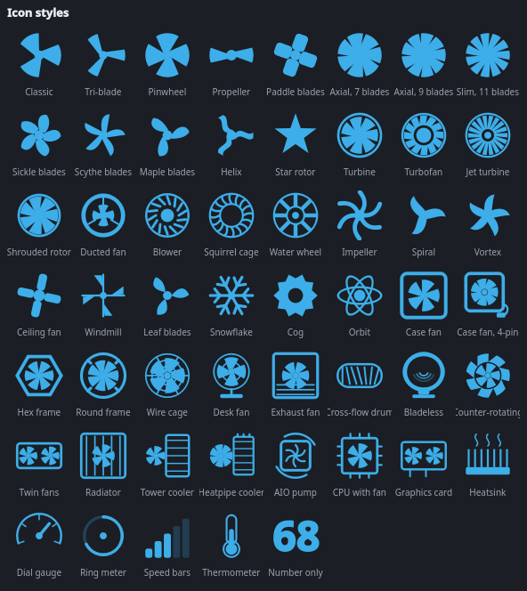
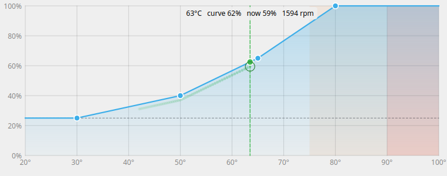
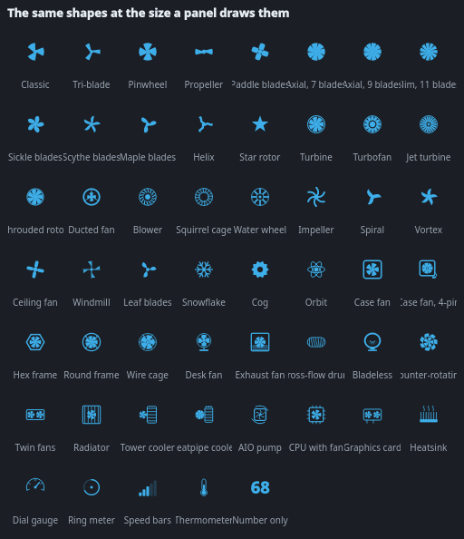
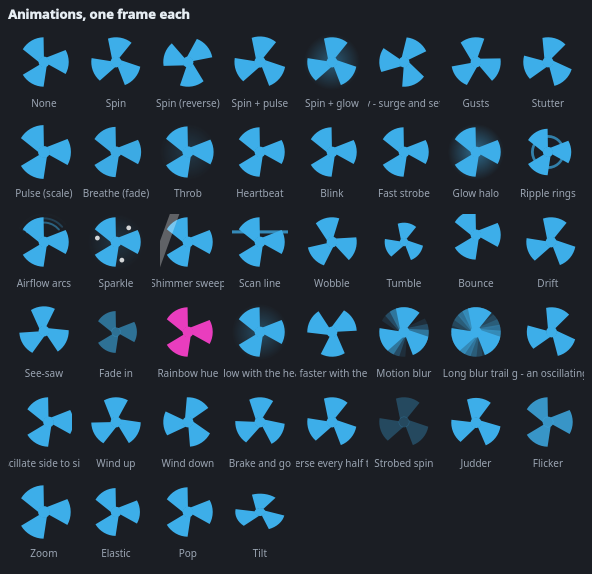
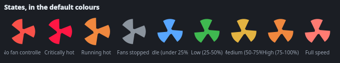

# Fan Control KDE

Every fan the machine will admit to having, in the system tray. Set a speed by
hand, hand a fan back to its firmware, or draw a fan curve on a graph and have a
small system service run it.



The icon is painted every frame rather than loaded from a file, which is what
lets it spin at a rate taken from the **measured rpm**, take a colour from the
hottest sensor, and follow the panel's own foreground in light and dark themes.

---

## Install

One line, on Fedora, Debian, Ubuntu, Arch and their derivatives:

```sh
curl -fsSL https://raw.githubusercontent.com/gabrielmf1998/Fan-Control-KDE/main/install-online.sh | sh
```

or from the mirror:

```sh
curl -fsSL https://gitlab.com/gabriel17166/fan-control-kde/-/raw/main/install-online.sh | sh
```

It works out which package your distribution wants, takes it from the latest
release, checks it against the `SHA256SUMS` published beside it, and installs it.

<details>
<summary>Or take a package from the release page</summary>

| Distribution | File |
| --- | --- |
| Fedora, RHEL, Nobara | `fan-control-kde-2.1.0-1.fc*.noarch.rpm` |
| Debian, Ubuntu, Mint | `fan-control-kde_2.1.0-1_all.deb` |
| Arch, Manjaro, CachyOS | `fan-control-kde-2.1.0-1-any.pkg.tar.zst` |
| Anything else | `Fan-Control-KDE-x86_64.AppImage` |

The AppImage needs `python3` and `PySide6` on the system, and it **cannot ship
the privileged helper** — `pkexec` will only run a real file on disk that a
polkit policy names by path. Without a packaged install it can neither read nor
change anything, because every fan control on Linux needs root.

</details>

<details>
<summary>Or from a clone</summary>

```sh
git clone https://github.com/gabrielmf1998/Fan-Control-KDE
cd fan-control-kde
./install.sh
```

`./install.sh uninstall` takes it back out. Your settings and curves stay.

</details>

Once it is running: **Settings → Updates → Check for updates** finds a newer
release on either forge, shows what changed, and installs it on a click.

---

## What it can drive

Fan control is not one interface, it is four, and which one a machine has
decides what is possible on it. This is what each one actually gives you.

### Motherboard headers — the CPU fan and the case fans

Through the kernel's own `hwmon` PWM interface, so **any chip with a driver
works**: the whole nct6775 family (nct6106 through nct6799), it87, f71882fg,
w83627, `dell_smm` on Dell laptops, `thinkpad_acpi`, `applesmc`, the ASUS WMI
and EC sensor drivers.

Every header is its own fan here, listed and controlled one at a time — not one
ganged "CPU / case" device. Header 1 is guessed to be the CPU fan and the rest
chassis headers, and you can rename any of them to whatever is actually plugged
in.

> **AMD or Intel makes no difference to this.** The CPU fan header is on the
> motherboard, driven by the board's Super I/O chip; the CPU is not involved in
> its own fan at all. A Ryzen machine and a Core machine are the same problem.
> What differs is the *temperature* you point a curve at: `k10temp` (Tctl/Tccd)
> on AMD, `coretemp` (Package id 0) on Intel. Both are listed.

If nothing turns up, the Super I/O driver is not loaded. `sudo sensors-detect`
finds it; a few boards also need `acpi_enforce_resources=lax` on the kernel
command line, because ACPI claims the chip and the driver politely stands down.

### AMD Radeon

| Cards | How | What you get |
| --- | --- | --- |
| RX 400, RX 500 (Polaris), Vega, RX 5000 (RDNA1), RX 6000 (RDNA2) | `amdgpu` hwmon `pwm1` | Flat manual duty, auto, full range |
| RX 7000 (RDNA3), RX 9000 (RDNA4) | overdrive fan curve, `gpu_od/fan_ctrl/` | A **firmware fan curve**, zero-rpm, acoustic limits |

RDNA3 and RDNA4 are the important row. Those cards' firmware very often
**refuses flat manual PWM** — the write lands, the driver returns success, and
the fan does not move. What they do have is a real fan curve in the firmware, and
this writes to it. Draw the curve, press *Write it into the firmware*, and the
card runs it with nothing loaded at all.

That interface needs OverDrive turned on, which is a kernel parameter:

```
amdgpu.ppfeaturemask=0xffffffff
```

Zero-rpm control (`fan_zero_rpm_enable`, `fan_zero_rpm_stop_temperature`) is
RDNA3-and-newer on Linux 6.13 or later.

### NVIDIA

GeForce, Quadro and RTX cards, through `nvidia-settings`. It needs two things
that have nothing to do with this program:

* **`Coolbits` in the X configuration.** `sudo nvidia-xconfig --cool-bits=28`,
  or an `Option "Coolbits" "28"` line in the `OutputClass` section of
  `/usr/share/X11/xorg.conf.d/10-nvidia.conf`. Without it the driver refuses
  every fan write — and exits 0 while doing so, which is why this reads the
  speed back afterwards and tells you what the driver actually kept.
* **An X or XWayland display.** `nvidia-settings` has no Wayland-native path
  yet. On a Plasma Wayland session it works through XWayland, which is what the
  helper points it at.

Most GeForce cards clamp their minimum to about 30%; the range the driver
reports is read out of it, and the menu will not offer anything below it. NVIDIA
exposes no firmware fan curve to Linux, so a curve on an NVIDIA card is run by
the background service.

`nvidia-smi` is used for the readings — speed, temperature and utilisation — and
cannot set anything.

### Intel

Discrete Arc cards report fan speed through the `i915`/`xe` hwmon
(`fan1_input`), and that is all mainline has: the PWM control patches for `xe`
are not merged. Those cards are listed as monitor-only, with that as the stated
reason rather than being hidden. If a kernel with the control patches is running,
the PWM channel appears and the generic hwmon backend drives it with no changes
here.

Intel integrated graphics have no fan; the fan cooling an Intel CPU is on a
motherboard header, covered above.

---

## Fan curves



Drag the points. Click the empty graph to add one, right-click a point to remove
it, hold <kbd>Shift</kbd> while dragging to change only the duty.

The dashed green line is the sensor this curve follows, *right now*. The filled
dot is what the curve asks for at that temperature; the hollow ring is what the
fan is actually doing. Watching those two while a game loads tells you more about
whether a curve is right than any amount of arithmetic.

Nine starting points — Silent, Quiet, Balanced, Performance, Aggressive, Linear,
Stepped, Zero RPM, Full blast — and every one of them is just a curve, so you can
grab a preset and then move it.

**How it responds**, all of it per fan:

| | |
| --- | --- |
| **Hysteresis** | How far the temperature has to fall before the fan eases off. This is what stops a fan hunting up and down at a steady load. |
| **Ramp up / ramp down** | Percentage points per second, separately in each direction. Slow on the way down is what makes a curve sound calm. |
| **Never below / never above** | A floor and a ceiling, drawn on the graph where they will bite. |
| **Stop the fan below** | Zero-rpm: below this temperature the fan stops entirely. |
| **Kick to start at** | A stopped fan will not take a low duty from standing. This gives it a shove for a moment first. |

### Calibration — what the fan actually does

Guessing the bottom of a curve is the one thing you cannot do from a datasheet,
because it is not the fan's specification, it is *this* fan on *this* header.

*Calibrate* sweeps it from 0% to 100% in steps, waits for it to settle at each
one, and writes down the rpm. Out of that comes the number that matters: **the
duty this fan actually starts turning at**. A curve that dips below it does not
run the fan quietly — it stops it.

Take the measurement, pick a style, and it builds a curve that respects it.

### Where a curve runs

**In a system service.** `fan-control-kde-curve.service` applies curves whether
or not anyone is logged in, and hands every fan it touched back to the firmware
when it stops — a curve daemon that dies must not leave a fan at 20% while the
CPU cooks. Above 95 °C every curve is overridden and the fan goes to 100%; a fan
curve is a comfort setting and that part is not negotiable. If a curve's
temperature source stops answering, that fan goes to 70% rather than to silence.

**Or in the firmware**, where the hardware has one:

* nct6775-family Super I/O chips have Smart Fan IV — five anchor points and a
  temperature source. The curve is resampled to those five, the top one pinned
  at full speed, and written in.
* RDNA3 and RDNA4 Radeons have the overdrive fan curve described above.

A firmware curve runs with nothing loaded: before login, while the machine is
booting, and in any other operating system on it. *Undo that* hands the fan back.

---

## The rest of it


**53 icon shapes, 30 of them fan rotors.** Three-blade classic, tri-blade,
pinwheel, propeller, paddle, axial in 7, 9 and 11 blades, sickle and scythe and
maple blades, a helix, a star, a turbine, a turbofan, a jet turbine, a shrouded
rotor, a ducted fan, a blower, a squirrel cage, a water wheel, an impeller, a
spiral, a vortex, a ceiling fan, a windmill, leaf blades.

Then **17 housings**, where the frame stays still and only the rotor turns: a
case fan, a case fan with its 4-pin tail, hex and round frames, a wire cage, a
desk fan on its stand, a wall exhaust fan, a cross-flow drum, a bladeless ring, a
counter-rotating pair, twin fans, a radiator, a tower cooler, a heatpipe cooler,
an AIO pump, a CPU and a graphics card.

And **six meters** that show a reading instead of turning: a heatsink, a dial, a
ring, bars, a thermometer and a plain number.



Every one of them is drawn to survive 22 px, because that is the only size that
actually matters.



**44 animations.** The ones worth naming are the ones that only make sense on a
fan: **Motion blur** and **Long blur trail** smear the trailing edge across a
real arc — a few degrees of smear vanishes behind the blade in front of it, so
these use a wide one, and on a dense rotor they fill into the near-solid disc a
fast fan actually looks like. **Swing** turns the blades while the whole head
sweeps, like an oscillating fan. **Rev** surges and settles the way a fan ramps
under load; **Wind up** and **Wind down** run the whole range; **Brake and go**
stops it dead for a beat. **Gusts** buffets it, **Stutter** and **Strobed spin**
freeze it the way a camera does, **Judder** shakes it with no period the eye can
lock on to, **Airflow** sweeps arcs off the blade tips, and **Glow with the
heat** brightens with the hottest sensor.



**Nine states**, each with its own colour and its own animation, resolved top to
bottom so a machine that is too hot says so even while its fans sit at 40%:
no controller, critically hot, running hot, stopped, idle, low, medium, high,
full. Eight colour presets, or set every one by hand.

Everything else that was asked for and is now there: icon **size** (22 to 96 px),
fill of the tray cell, stroke weight, inner margin, **frame rate** (5–60 fps),
animation speed, the rotation range in degrees per second and whether rotation
follows measured rpm, requested duty or nothing; a **number badge** on the icon
showing duty, rpm, temperature or how many fans are turning, in four shapes and
any corner; a **corner pip** for who is driving the fans; **start with the
system**; per-fan **renaming**; notifications for heat, for a fan that stalls,
and for what a curve is doing; and the temperature sensors listed with the
unpopulated ones marked.

> Super I/O chips wire more thermistor inputs than any board populates, and the
> empty ones do not read as absent — they read as 15 °C, or 102 °C, or 0. Those
> are marked, and are never what turns the icon red. They stay selectable for a
> curve, because on some boards one of them really is the VRM.

---

## How it works, and what it asks for

Reading is unprivileged and constant. Everything that writes goes through a
helper under `pkexec`, and there are **two** polkit actions, on purpose:

`io.github.gabrielmf1998.fancontrol` — fans, curves, the two services. The
shipped `49-fan-control-kde.rules` lets members of `wheel` through without a
prompt, because the tray changes fan speeds constantly and a fan speed is worth
nothing to an attacker who already has your session. Delete that file to be
asked once per session instead.

`io.github.gabrielmf1998.fancontrol.install` — installing an update. A separate
action on a separate binary, deliberately **not** in the rules file, and set to
ask every single time. Adding it there would turn *change a fan speed without a
password* into *install anything without a password*. The installer refuses any
package the system's own tools do not say is called `fan-control-kde`, and the
download is checked against the release's `SHA256SUMS` before it gets that far.

| Path | What is in it |
| --- | --- |
| `~/.config/fan-control-kde/config.json` | Appearance and behaviour |
| `/etc/fan-control-kde/curves.json` | The curves |
| `/etc/fan-control-kde/state.json` | Speeds to put back after a reboot |
| `/run/fan-control-kde/status.json` | What the curve daemon is doing right now |

The helper is a plain command-line program and is worth knowing about:

```sh
/usr/libexec/fan-control-helper status      # everything, as JSON
/usr/libexec/fan-control-helper sensors     # every temperature it can see
sudo /usr/libexec/fan-control-helper set hwmon:nct6799:pwm2 60
sudo /usr/libexec/fan-control-helper calibrate hwmon:nct6799:pwm2
sudo /usr/libexec/fan-control-helper hwcurve hwmon:nct6799:pwm1
```

---

## When it does not work

**No fan controller found.** The Super I/O driver is not loaded — run
`sudo sensors-detect`, and if the chip is detected but the driver still refuses
it, add `acpi_enforce_resources=lax` to the kernel command line.

**A speed is accepted and nothing moves.** The write is read back, so this is
reported rather than assumed. On an RDNA3 or RDNA4 Radeon it means the firmware
wants its fan curve instead — draw one and write it in. On NVIDIA it means
`Coolbits` is not set.

**A fan reads 0 rpm at every duty.** Either nothing is plugged into that header,
or the fan has no sense wire. It can still be driven; it just cannot be measured,
so calibration has nothing to report and the icon takes its rotation from the
duty instead.

**The icon is not moving.** *Keep animating while the fans are stopped* is off
and the fans are stopped, which is the icon telling you the truth.

---

## Building the packages

```sh
make check          # syntax
make icons          # regenerate the icon and the documentation sheets
make packages       # dist/: .rpm, .deb, .pkg.tar.zst, .AppImage, SHA256SUMS
```

---

MIT. Not affiliated with AMD, NVIDIA, Intel or KDE.

Mirrored at [gitlab.com/gabriel17166/fan-control-kde](https://gitlab.com/gabriel17166/fan-control-kde).
