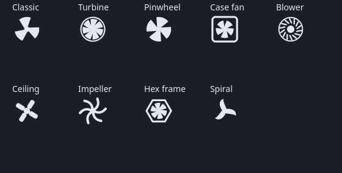

# Fan Control KDE

A system tray applet for KDE Plasma that sets **CPU/case fan** and **NVIDIA GPU
fan** speed. Tray icon only — no windows, no dialogs. The icon is a fan that
spins at a rate proportional to the *measured* RPM, and stops only when the
fans have actually stopped.



_The nine icon styles, each drawn at runtime._

## What it does

- Sets motherboard fan headers (via the kernel `hwmon` interface) and the
  NVIDIA GPU fan (via `nvidia-settings`).
- Shows live RPM and temperature for both, refreshed every 4 s.
- Optionally restores your chosen speeds on every boot.
- Nine hand-drawn fan icons, painted at runtime so they follow your panel's
  colour in light and dark themes.

## Requirements

| | |
|---|---|
| Desktop | KDE Plasma (X11 or Wayland) — needs a StatusNotifierItem tray |
| Python | 3.9+ |
| Qt bindings | **PySide6** |
| Privileges | **polkit** (`pkexec`) |
| Init | **systemd**, only for the "keep after reboot" option |

**For motherboard fans:** a Super I/O chip with a `pwm*` interface under
`/sys/class/hwmon`. The `nct6775` driver family covers most consumer boards;
load it with `modprobe nct6775` if `sensors` shows no fans. Developed against
an **nct6799** (ASRock B650M-HDV/M.2).

**For the GPU:** the NVIDIA proprietary driver with `nvidia-smi` and
`nvidia-settings`, and a running X or XWayland session. AMD and Intel GPUs are
not supported — the tray simply hides the GPU entry.

### Fedora
```
sudo dnf install python3-pyside6 polkit lm_sensors
```
### Arch
```
sudo pacman -S pyside6 polkit lm_sensors
```

## Install

Download a package from [Releases](../../releases), or:

```bash
git clone https://github.com/gabrielmf1998/fan-control-kde
cd fan-control-kde
sudo make install
```

Then start `fan-tray`, or log out and back in — the desktop entry autostarts it.

## Hardware quirks worth knowing

These are not bugs in this program; they are how the hardware behaves.

**The NVIDIA API only accepts 30–100 %.** `GPUTargetFanSpeed` refuses anything
lower — and `nvidia-settings` still exits 0 when it refuses, so a naive tool
reports success while the fan never moves. The helper clamps to the driver's
own advertised range and then **reads the speed back** to report what really
happened. Many cards still stop their fans entirely at the low end via their
own zero-RPM mode, so 0 % is often a real outcome.

**Motherboard fans may not stop at 0 %.** Most 4-pin fans have a mechanical
minimum and keep turning at ~500 rpm even at 0 % duty. If your board exposes
DC mode (`pwmN_mode = 0`) the fan can be stopped by cutting voltage, but many
boards are PWM-only and reject the switch.

**NVIDIA exposes no `hwmon`.** There is no `pwm` file in `/sys` for the GPU;
`nvidia-settings`/NVML is the only route, which is why an X or XWayland session
is required even on Wayland.

## How it is put together

```
fan-tray            tray applet (PySide6), runs as you
fan-tray-helper     runs as root through polkit; only touches fan controls
```

The helper is bound to a single polkit action. `data/49-fan-control-kde.rules`
lets members of `wheel` change fan speed without a password — delete it if you
would rather be asked (you then get one prompt per session).

A tray menu is exported over **DBusMenu** and drawn by the panel, not by Qt.
That protocol carries labels, checkmarks, separators and submenus and nothing
else, which is why speed is a list of levels rather than a slider: an embedded
widget has no representation in it and renders as an empty box.

## Uninstall

```bash
sudo make uninstall
```

## Licence

MIT
